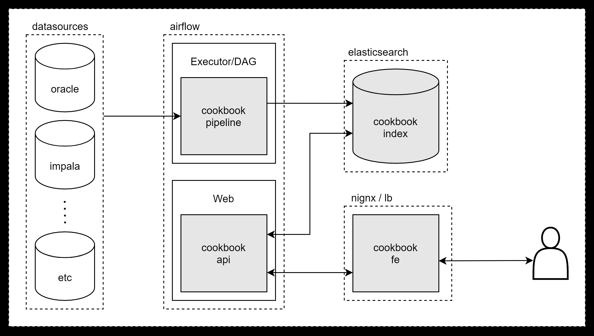
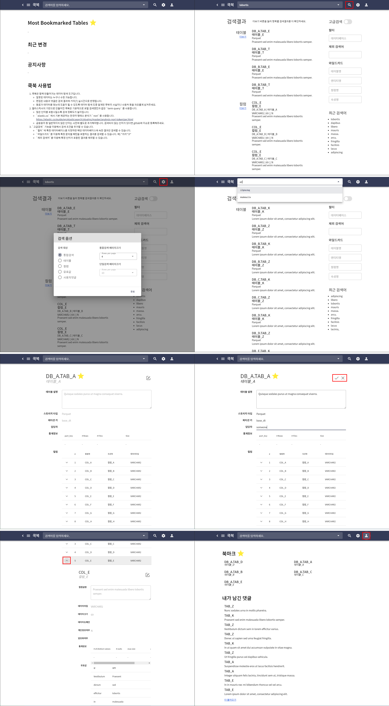

# cookbook

쿡북은 동료들과 함께 만들어가는 데이터 탐색 도구이며 다음과 같은 요소들로 구성되어있습니다.

1. Oracle, Impala 등의 데이터 스토어의 시스템카탈로그를 수집하는 파이프라인 (Airflow DAG)
2. Elasticsearch 기반 검색 기능 제공 API (Flask, Airflow web plugin)
3. 프론트엔드 (vue)



> as an airflow plugin

백엔드는 Airflow 플러그인으로 실행되며 인증 등 Airflow 웹의 자원들을 공유합니다.

> es only store

추가 저장소 없이 store & search 에 elasticsearch 만을 이용하며, 한글 형태소분석기로 [`nori`](https://www.elastic.co/guide/en/elasticsearch/plugins/master/analysis-nori-tokenizer.html) 를 사용합니다.

> metadata browser

vue 2.0 × vuetify 기반의 화면을 제공합니다.




## Project setup for development

### Prerequisites

* RBAC-enabled airflow (1.10.10)
* Docker
  * elasticsearch:7.13.4
  * kibana:7.13.4
* Node (npm)

### cookbook-index

```bash
git clone https://github.com/oboki/cookbook-index.git
cd cookbook-index

# initialize cluster
docker-compose up -d

# create indices
python scripts/init_index.py

# load sample data
python scripts/load_sample_data.py
```

### cookbook-api

```bash
git clone https://github.com/oboki/cookbook-api.git
cd cookbook-api

# install plugin
mkdir $AIRFLOW_HOME/plugins/cookbook-fe
ln -s app $AIRFLOW_HOME/plugins/cookbook-fe/.

# restart airflow web
```

### cookbook-fe

```bash
git clone https://github.com/oboki/cookbook-fe.git
cd cookbook-fe
```

`vim .env.localhost` 파일을 열어 API 경로를 로컬 환경에 맞춰 수정한 뒤

```
VUE_APP_API=http://172.30.81.15:8080/cookbookapi/v1
```

다음 명령어로 의존성 설치 및 개발서버 실행

```bash
npm install
npm run serve
```